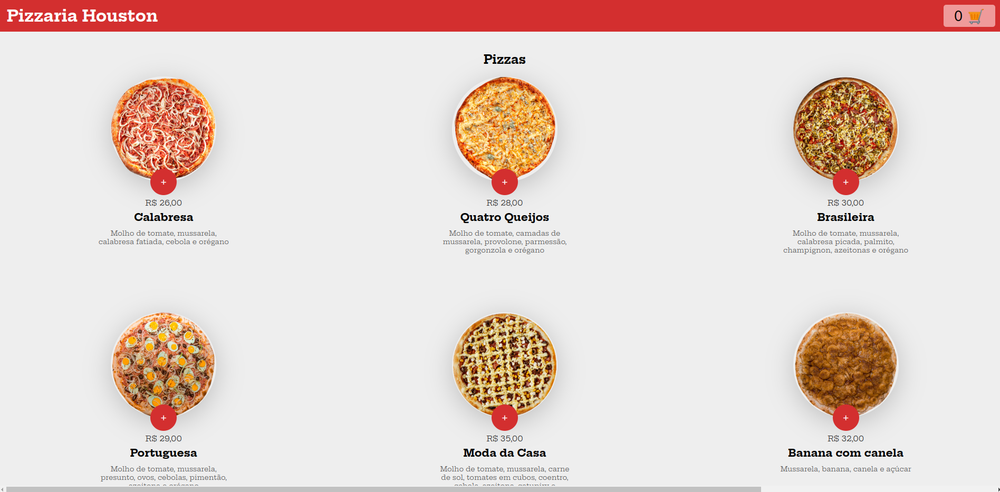
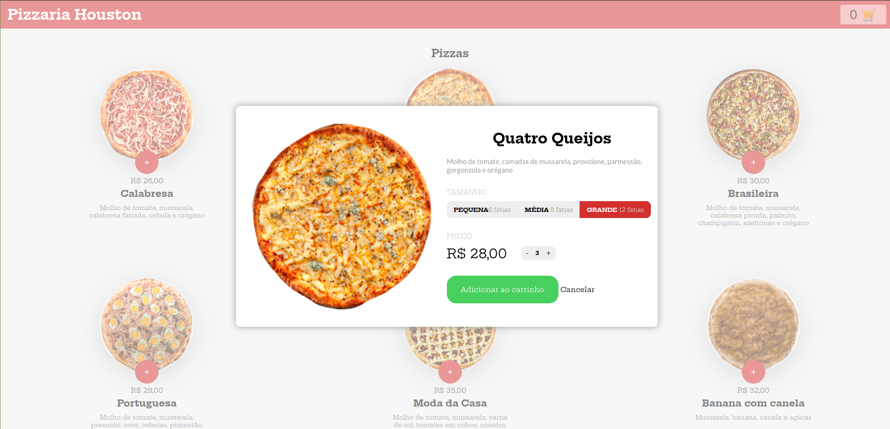
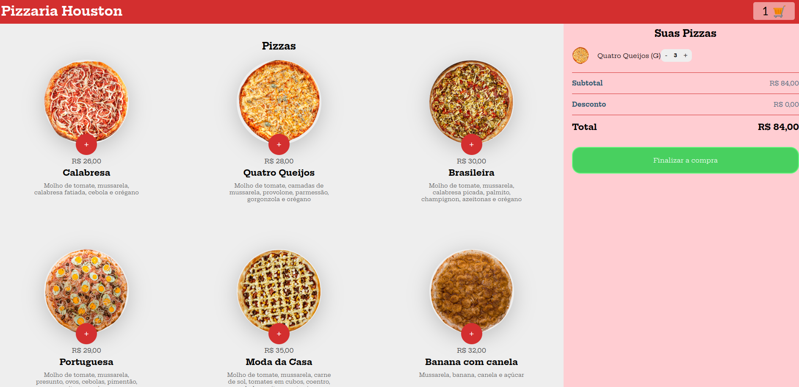

## About the project:

this project is an application made in order to develop and deepen my skills with javascript html and css. Applying in practice the knowledge for the development of an website.

## Layout of the Application:

  
  
  

## Launching the App:

### Pre requirements

#### Before start, you should need have installed in your computer those following tools:

 [Git](https://git-scm.com)</img>
</br>
 [Node.js](https://nodejs.org/en/) (To manage the project modules)</img>

#### It is also recommended a good code editor, for example:

 [VSCode](https://code.visualstudio.com/)</img>

</br>

### :gear: Starting the App:

```bash

# Clone the Repository
$ git clone https://github.com/Cleyfson/pizzaria-houston.git

# Enter the poject folder in the Terminal
$ cd pizzaria-houston

# Install all the dependencies
$ npm install

# Execute the appliction with this command
$ npm run dev

# The server will start in the port:5173

```

---

## :man_technologist: Used Technologies:

Those following tools were used in the project development:

### **Application** ([Javascript](https://developer.mozilla.org/pt-BR/docs/Web/JavaScript) + [HMTL5](https://dev.w3.org/html5/spec-LC/) + [CSS3](https://www.w3.org/Style/CSS/software))

</br>
